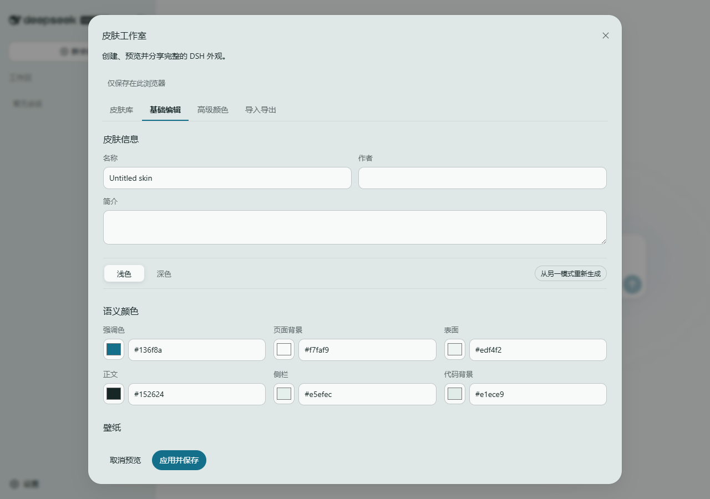

# dsh-skin-studio

为 DeepSeek Harness Web UI 创建、管理和分享可移植皮肤。

`dsh-skin-studio` 保留 DSH 原生的浅色、深色和跟随系统行为，并通过官方 `--dsw-*` Theme Token 叠加用户皮肤。每套皮肤可包含两套可编辑配色、主背景、组件媒体背景、界面/代码字体、受控的 DSH 内置视觉素材替换，以及中英文界面文案覆盖。



## 安装

```sh
dsh plugin --profile web add dsh-skin-studio
dsh web
```

打开 **设置 → 通用 → 自定义皮肤**。

## 功能

- 多皮肤库：新建、复制、编辑、启用、删除和恢复 DSH 默认。
- 浅色/深色各有六个易懂的语义颜色。
- “界面组件”按输入框、按钮、侧边栏、消息、代码、边框和状态色分组编辑。
- “全部 DSH Token”覆盖运行时公开颜色和插件验证过的组件颜色白名单。
- 用 OKLCH 生成另一模式，生成后仍可独立微调。
- 整页实时预览，并明确区分“应用”和“取消”。
- PNG、JPEG、WebP、MP4、WebM 背景，可分别调整浅深模式的背景透明度、界面遮盖强度和明暗遮罩；视频始终静音并自动循环。
- 背景媒体使用居中覆盖裁切，并跟随右侧主对话区域自适应，不会铺到左侧会话列表下方。
- 支持鼠标和键盘操作的组件点选器可选择侧边栏、输入框、按钮、消息气泡、菜单、面板或任何其他可见 DSH 组件类型；“操作界面”模式可先正常点击按钮、展开菜单或打开弹窗，再用顶部按钮或 `F2` 切回“选择目标”。每类可使用独立图片或静音循环视频，并分别调整浅深模式的透明度和遮罩。
- 独立“素材替换”页可替换空状态鲸鱼、Hero 背景插图、侧边栏左侧品牌图标、右侧品牌字样和工作区文件夹图标；支持“图标 + 字样”和“单图品牌”两种侧边栏品牌布局。单图模式展开时隐藏左侧图标，让完整 Logo 独占品牌区域；收起后仍保留左侧图标。
- 独立“文案”页可分别设置中英文欢迎标题、版本标记、欢迎输入提示、工作区选择和新会话；自由文本点选器还可安全替换普通可见文字与 placeholder，并可先切到“操作界面”展开隐藏内容，再统一作用于同类结构位置。
- 设置界面及入口、全部聊天记录、项目名称和会话名称不会被文本选择器修改；会话与项目名称继续使用 DSH 原生重命名功能。
- 每个语义 slot 会显示当前 DSH 视图中的兼容状态；定位失败只保留官方原素材或原文案，不影响整套皮肤。
- 组件视频仅在可见时播放，同时播放数量有上限；系统启用“减少动态效果”时会停在静态帧。遮罩过弱时必须确认可读性后才能应用。
- 可选 WOFF2 界面字体与代码字体。
- 高级模式只开放 DSH Theme Runtime 可接受、且插件明确列入白名单的颜色 Token。
- 内置 `Bright Studio`、`High Contrast`、`Tidal Paper`，并附带 14 套完整的虹咲主题皮肤。
- IndexedDB 版本化存储、轻量启动快照和同源标签页同步。
- `.dshskin` 皮肤包完整携带 `manifest.json` 与经过校验的本地资源。
- 中英文界面。

## 内置虹咲皮肤

首次启动会把 14 套带完整本地媒体的虹咲主题写入当前浏览器：上原歩夢、高咲侑、中須かすみ、桜坂しずく、朝香果林、宮下愛、近江彼方、優木せつ菜、エマ・ヴェルデ、天王寺璃奈、三船栞子、ミア・テイラー、鐘嵐珠，以及虹ヶ咲学園スクールアイドル同好会全团主题。

每套皮肤都包含浅色/深色配色、背景、角色化视觉素材、文案和八类独立组件背景。插件升级只刷新从未编辑过的内置版本；用户编辑后的版本不会被覆盖。私人皮肤“上原歩夢 自用”不在发布包中。

## 视觉素材缩放

视觉 Slot 会保持素材原始长宽比，并选择能让最终图片至少覆盖 DSH 原素材宽高的较大缩放倍数：

`scale = max(DSH 宽度 ÷ 素材宽度, DSH 高度 ÷ 素材高度)`

例如 DSH 原素材为 `1000 × 1000` 时：

- `200 × 300` 的素材显示为 `1000 × 1500`。
- `600 × 500` 的素材显示为 `1200 × 1000`。

一个方向与 DSH 原素材对齐，另一个方向允许超过。右侧“侧边栏品牌字样”是例外：分离模式使用 `scale = min(...)` 在 `156 × 32` 光学安全区内完整显示；单图模式直接对齐 DSH 原完整品牌宽度 `188px`，高度按素材比例计算，并将顶部品牌行增高到 `72px` 以避免裁切。标题鲸鱼、左侧品牌图标和文件夹优先使用 DSH SVG 自带的固定宽高；响应式背景会在父容器、窗口或字体布局变化后重新计算，避免刷新时尺寸漂移。

## 皮肤包安全

导入采用严格拒绝策略：必须符合 v5 schema、使用安全资源路径、声明正确大小，并通过文件签名和 SHA-256 校验。组件媒体目标只保存标签、角色和安全类名；自由文本目标只保存受控组件锚点、最长 6 层的相对子节点路径和直接 Text 节点索引或 placeholder 属性；Visual/Copy Slot 只保存插件公开的语义 ID。SVG、GIF、网络 URL、任意 selector、XPath、CSS、HTML、JavaScript 和路径穿越都会被拒绝。单包上限 128 MB，背景图片上限 15 MB，视频上限 100 MB，替换素材和字体各上限 5 MB；已有 v1–v4 皮肤会自动迁移。

完整字段、迁移和 slot 目录见 [dshskin v5 格式](docs/skin-format-v5.md)。

应用前会报告低对比度问题；如果是有意设计，用户仍可确认后应用。

## 开发

```sh
pnpm install
pnpm check
pnpm pack
```

插件的 Host 半部为空实现，功能位于浏览器 Client bundle。运行时只使用 DSH 官方 Theme 与 Slot API，不需要自定义 Host 设置命名空间或服务器路由。

## 兼容性与边界

测试基线为 `@deepseek-ai/dsh 0.1.0-rc.8`，同时兼容 rc.6 的完整侧边栏品牌 SVG、rc.8 拆分后的品牌图标/字样结构及新增的 Hero Slot 包装层。配置只保存在当前浏览器 origin。v5 不包含跨浏览器 Host 同步、在线市场、任意 CSS/JS、任意 DOM selector、布局修改或全局圆角修改。DSH 尚未为内部视觉元素和既有 locale 命名空间提供覆盖 API，因此这些能力使用插件内置语义 slot 和受控结构路径；DSH 更新后无法定位的目标会安全跳过。

## 许可证

代码采用 MIT 许可证。内置虹咲皮肤中的第三方角色、标志和其他媒体不属于 MIT 授权范围，详见 [THIRD_PARTY_ASSETS.md](THIRD_PARTY_ASSETS.md)。请只导出你有权分享的背景媒体和字体文件。
