<h1 align="center">dsh-skin-studio</h1>

<p align="center">
  为 DeepSeek Harness Web UI 创建、预览、管理和分享完整皮肤。
</p>

<p align="center">
  <a href="https://www.npmjs.com/package/dsh-skin-studio"></a>
  <a href="https://github.com/realMisakaMikoto/dsh-skin-studio/actions/workflows/ci.yml"></a>
  <a href="https://github.com/realMisakaMikoto/dsh-skin-studio/blob/main/LICENSE"></a>
  
</p>

`dsh-skin-studio` 是面向 DeepSeek Harness Web profile 的本地皮肤工作室。每套皮肤可以同时携带浅色/深色配色、主背景、组件媒体、品牌与图标素材、双语文案、自由文本规则和字体，并通过 `.dshskin` 文件完整导入导出。

## 安装

要求 Node.js 20 或更高版本，以及 DeepSeek Harness Web profile。

```sh
dsh plugin --profile web add dsh-skin-studio@0.5.0 --save-exact
dsh web
```

打开 **设置 → 通用设置 → 自定义皮肤 → 打开皮肤工作室**。

## 当前版本提供

- 17 套内置皮肤：`Bright Studio`、`High Contrast`、`Tidal Paper`，以及 14 套虹咲主题。
- 完整保留 DSH 的浅色、深色和跟随系统外观模式。
- 六组语义配色与完整 DSH Theme Token 编辑。
- PNG、JPEG、WebP、MP4、WebM 主背景，支持透明度、界面覆盖、遮罩与模糊调节。
- 可视化组件点选器，为输入框、侧边栏、按钮、选择器、菜单和其他组件分别设置图片或静音循环视频。
- “选择目标 / 操作界面”双模式，可先展开菜单或临时界面，再选择实际组件。
- 空状态标志、Hero 插图、侧边栏品牌图标、完整 Logo 和工作区文件夹图标替换。
- 中英文固定文案与自由文本选择器，支持普通文字和 placeholder。
- WOFF2 界面字体与代码字体。
- IndexedDB 本地皮肤库、启动快照和同源标签页同步。
- `.dshskin` v5 导入导出、版本迁移、资源签名与 SHA-256 完整性校验。

## 13 位角色皮肤

以下截图来自 `0.5.0` 的实际 DSH 新会话页，统一使用浅色模式和完整视口。

<table>
  <tr>
    <td width="50%" valign="top">
      <strong>上原歩夢</strong><br>
      <sub>樱花粉与夕阳暖金交织的温柔海滨舞台。</sub><br><br>
      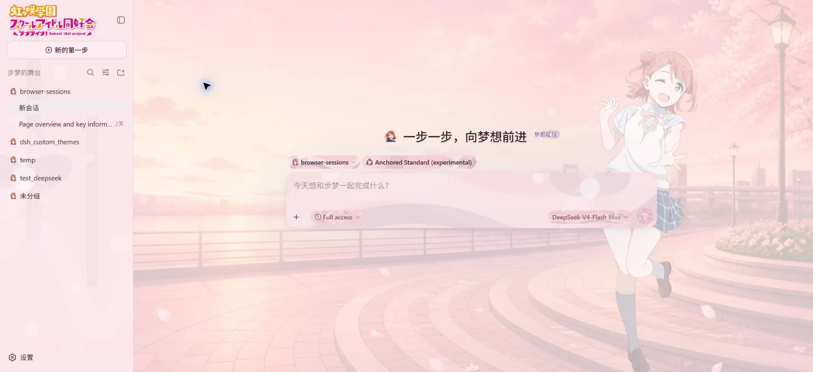
    </td>
    <td width="50%" valign="top">
      <strong>高咲侑</strong><br>
      <sub>黑与薄荷绿交织的创作舞台，为每一次心动写下旋律。</sub><br><br>
      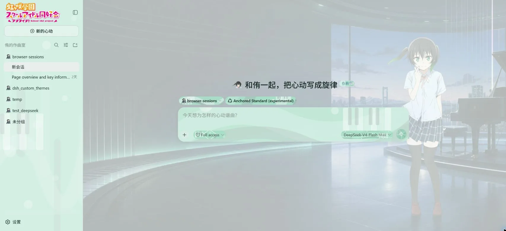
    </td>
  </tr>
  <tr>
    <td width="50%" valign="top">
      <strong>中須かすみ</strong><br>
      <sub>奶油黄与莓果色的可爱作战室。</sub><br><br>
      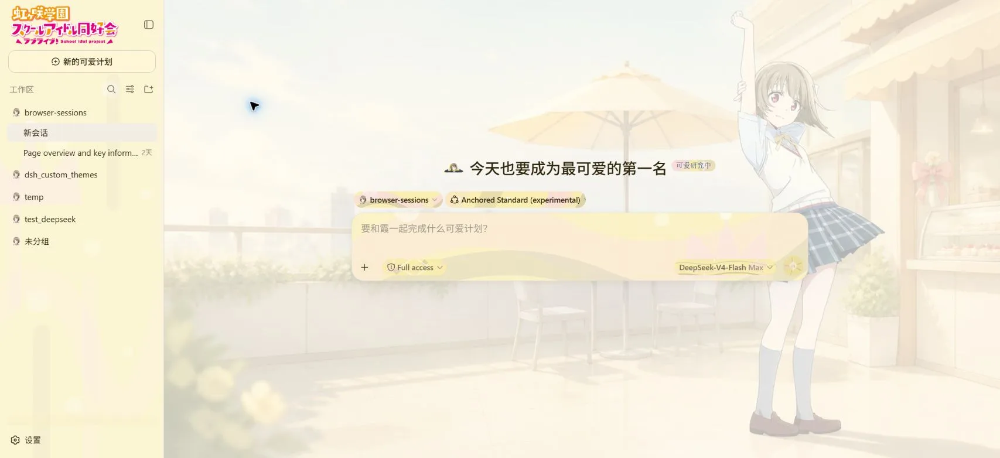
    </td>
    <td width="50%" valign="top">
      <strong>桜坂しずく</strong><br>
      <sub>深蓝幕布与脚灯构成的安静剧场。</sub><br><br>
      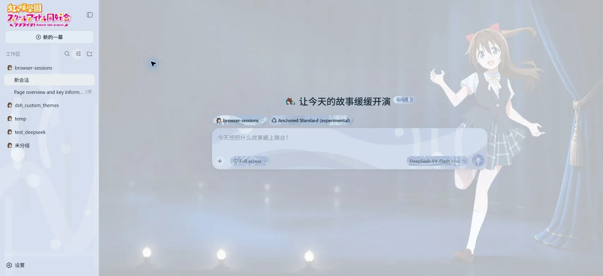
    </td>
  </tr>
  <tr>
    <td width="50%" valign="top">
      <strong>朝香果林</strong><br>
      <sub>靛蓝夜色中的精致时装工作室。</sub><br><br>
      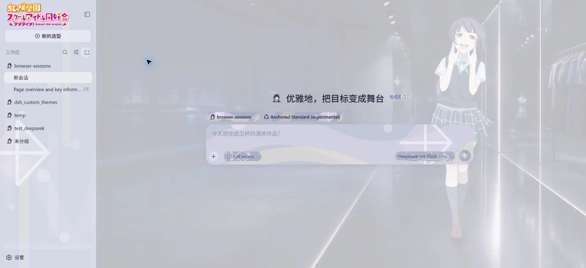
    </td>
    <td width="50%" valign="top">
      <strong>宮下愛</strong><br>
      <sub>被橙色夕阳点亮的快乐海滨。</sub><br><br>
      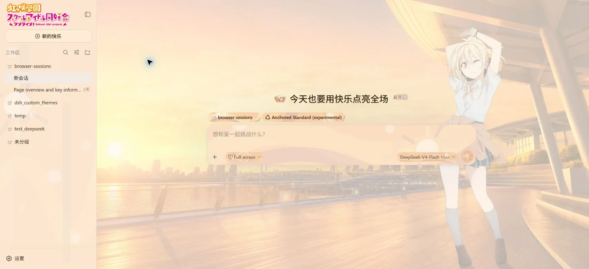
    </td>
  </tr>
  <tr>
    <td width="50%" valign="top">
      <strong>近江彼方</strong><br>
      <sub>薰衣草月夜里的柔软休息室。</sub><br><br>
      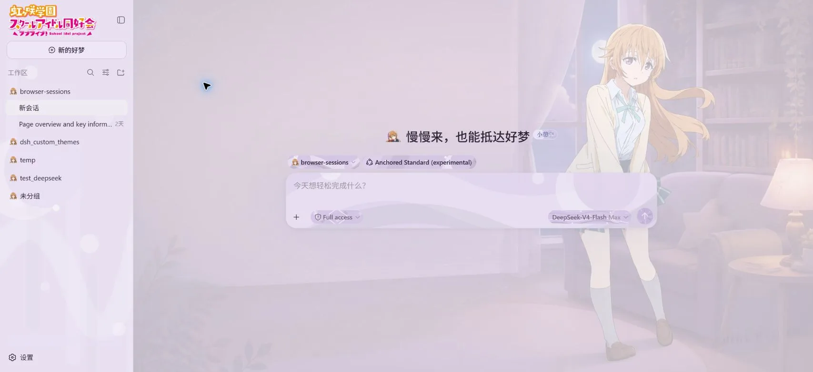
    </td>
    <td width="50%" valign="top">
      <strong>優木せつ菜</strong><br>
      <sub>把热爱点燃到最后一刻的赤红舞台。</sub><br><br>
      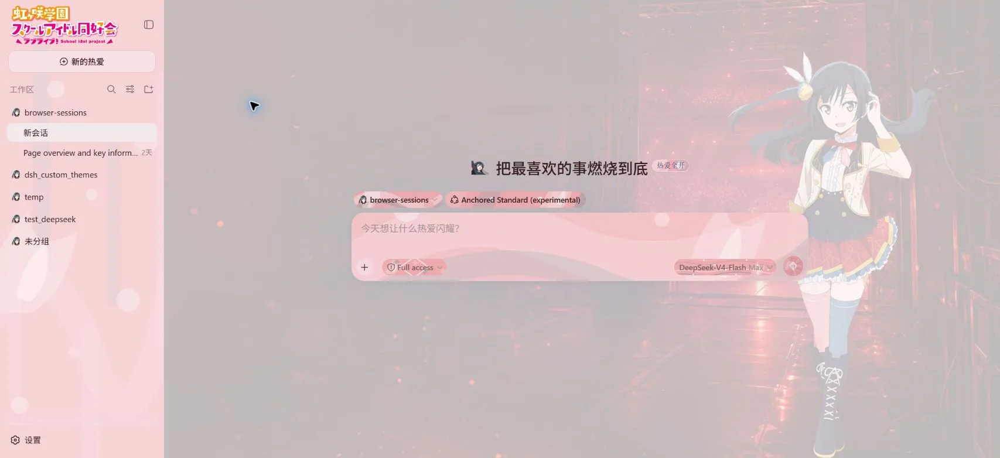
    </td>
  </tr>
  <tr>
    <td width="50%" valign="top">
      <strong>エマ・ヴェルデ</strong><br>
      <sub>连接山野与台场的清新绿色庭院。</sub><br><br>
      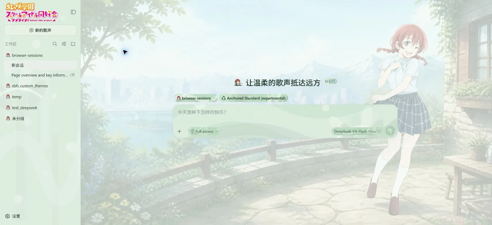
    </td>
    <td width="50%" valign="top">
      <strong>天王寺璃奈</strong><br>
      <sub>青蓝与粉色信号构成的数字实验室。</sub><br><br>
      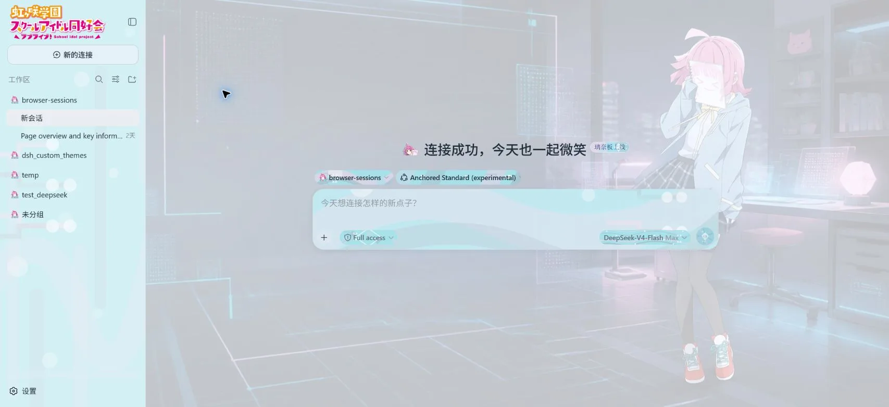
    </td>
  </tr>
  <tr>
    <td width="50%" valign="top">
      <strong>三船栞子</strong><br>
      <sub>象牙白与翡翠色的学生会档案室。</sub><br><br>
      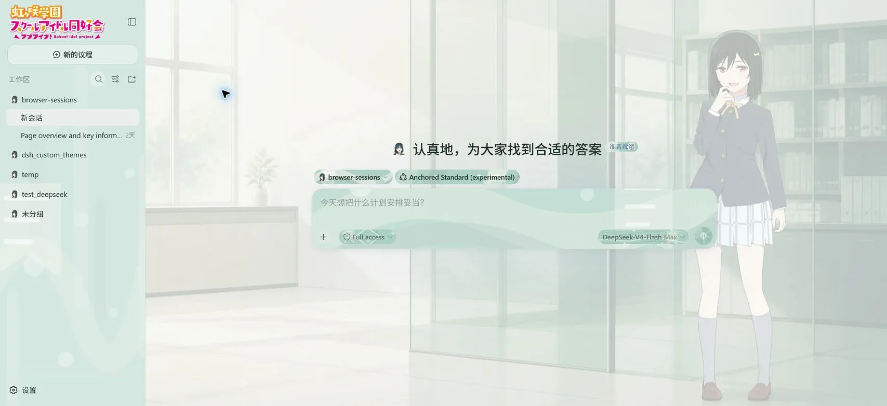
    </td>
    <td width="50%" valign="top">
      <strong>ミア・テイラー</strong><br>
      <sub>银色、冰青与深蓝交织的专业录音棚。</sub><br><br>
      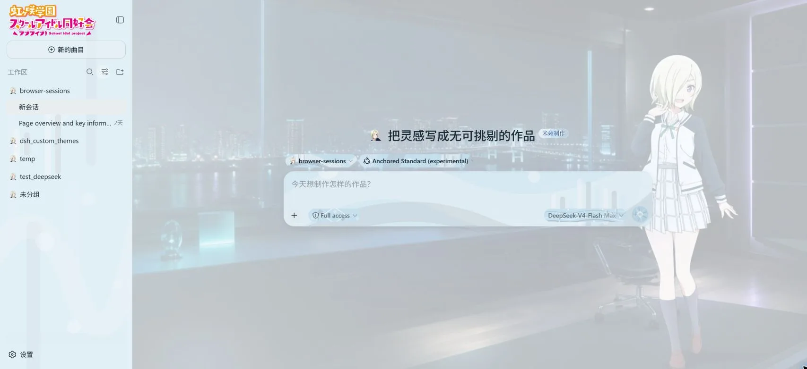
    </td>
  </tr>
  <tr>
    <td colspan="2" valign="top">
      <strong>鐘嵐珠</strong><br>
      <sub>洋红、深红与香槟金构成的顶层舞台。</sub><br><br>
      <p align="center">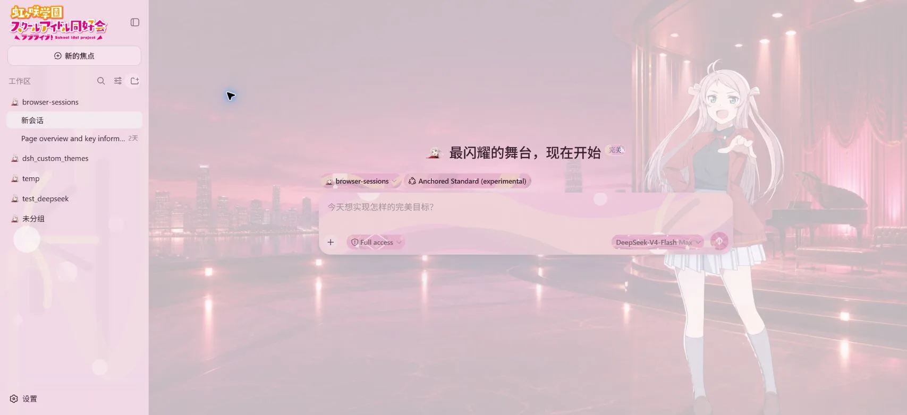</p>
    </td>
  </tr>
</table>

## 全团主题与基础预设

虹咲主题还包含 **虹ヶ咲学園スクールアイドル同好会** 全团皮肤，把十三人的角色色、彩虹组件纹样、团体背景和专属文案组合成一套完整外观。

基础预设提供三种不同方向：

| 皮肤 | 风格 |
| --- | --- |
| `Bright Studio` | 明亮、中性、清晰的工作画布 |
| `High Contrast` | 强调文字与控件区分度的高对比界面 |
| `Tidal Paper` | 安静的青绿色编辑画布 |

## 一套皮肤包含什么

| 内容 | 能力 |
| --- | --- |
| 配色 | 浅色与深色语义色、完整 DSH Token 覆盖 |
| 主背景 | 图片或静音循环视频、透明度、遮罩、模糊和界面覆盖 |
| 组件背景 | 同类组件统一应用，各组件独立媒体与浅深模式参数 |
| 视觉素材 | 标志、Hero、品牌图标、完整 Logo、文件夹图标 |
| 文案 | 中英文固定文案、自由文本、placeholder |
| 字体 | WOFF2 界面字体与代码字体 |
| 分享 | 包含 manifest 和本地资源的 `.dshskin` v5 文件 |

## 使用流程

1. 在皮肤库中新建、复制或选择一套皮肤。
2. 编辑浅色/深色配色、背景、组件、视觉素材、文案和字体。
3. 使用实时预览检查主界面，再选择“应用并保存”。
4. 在“导入导出”中生成 `.dshskin` 文件，或导入其他完整皮肤。

## `.dshskin` v5

`.dshskin` 是带版本的 ZIP 容器，包含 `manifest.json` 与皮肤引用的本地资源。v5 使用结构化组件目标、受控文本路径、语义 Visual/Copy Slot、资源大小与 SHA-256 描述符，并自动迁移 v1–v4 皮肤。

完整格式说明见 [docs/skin-format-v5.md](docs/skin-format-v5.md)。

## 兼容性

- DeepSeek Harness `0.1.0-rc.8`
- Node.js 20+
- React 18
- Chrome、Edge 等现代桌面浏览器
- rc.6 与 rc.8 的侧边栏品牌和 Hero 结构

皮肤保存在当前浏览器 origin 的 IndexedDB 中；同源标签页会同步当前皮肤状态。

## 开发

```sh
pnpm install --frozen-lockfile
pnpm check
pnpm pack
```

`pnpm check` 依次执行类型检查、72 项测试、构建和 npm 包内容校验。

## 相关链接

- [npm package](https://www.npmjs.com/package/dsh-skin-studio)
- [v0.5.0 Release](https://github.com/realMisakaMikoto/dsh-skin-studio/releases/tag/0.5.0)
- [`.dshskin` v5 格式](docs/skin-format-v5.md)
- [第三方素材说明](THIRD_PARTY_ASSETS.md)

## 许可证

项目代码采用 [MIT License](LICENSE)。内置主题使用的第三方角色、标志与媒体说明见 [THIRD_PARTY_ASSETS.md](THIRD_PARTY_ASSETS.md)。
